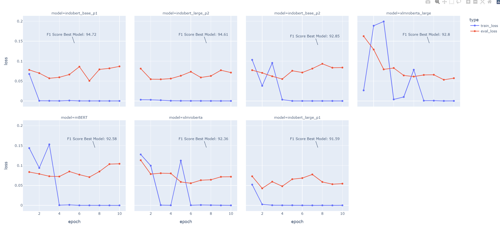

# Aspect-based Sentiment Classification Green PLN

## Requirements
```
pip install -r requirements.txt

```
## Training
```
python training.py --model_type='bert' --model='indobenchmark/indobert-base-p1' --num_epoch=10 --cuda_device=1

```
## Testing 

```
python testing.py  --model_type='bert' --model='indobenchmark/indobert-base-p1' --test_dir='DATASET/test_aux.csv'

```
## Demo

to find the probability value of the predicted result, use this script ( input : sentence (text) )

```
python demo.py  --model_type='bert' --model='indobenchmark/indobert-base-p1' 

```

## Experiment Results

